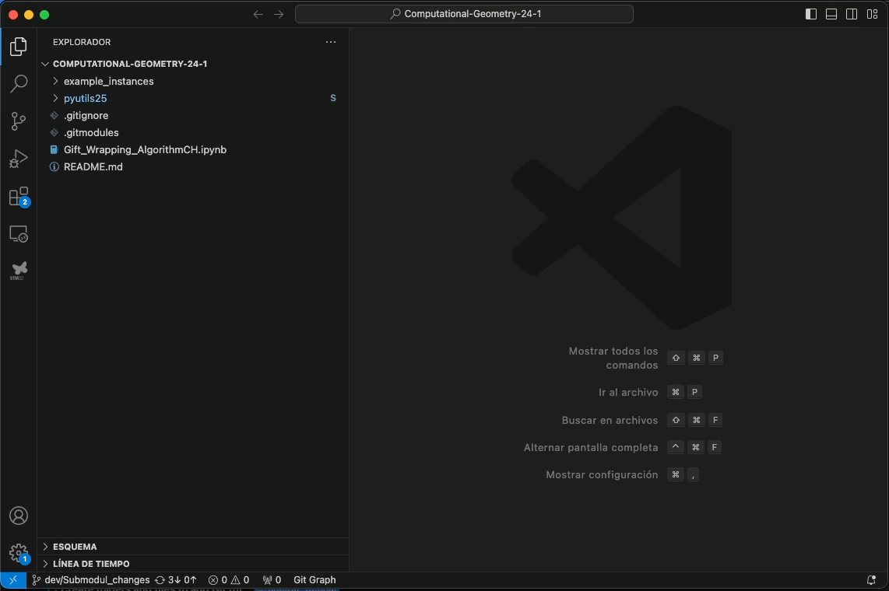

# GIT Tutorial

Here you can find the recomended steps to use Git andt Github using VSCode as interface.

Assuming that you already have a local git repository, follow the next steps:

1. `Update local repo`: Before start working on any change it is recommended sync your local repo with the remote repo. This way you can avoid merge conflicts. Remember you have to checkout manually to point at the last commit.

2. `Commit changes`: Before commit any change, first you have to create a new branch, (Note: it is not recommended create commits in the main branch). Once the branch is created and you are pointing to it, you can now commit your changes. Take into consideration that before commit changes you have to added to "stage", changes not added to stage won't be commited.

3. `Push branch`: Now that you have the mew branch and the commit (or commits) in your local repo, next step is push your branch to the remote repo.

